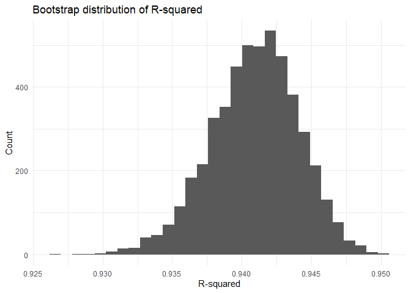
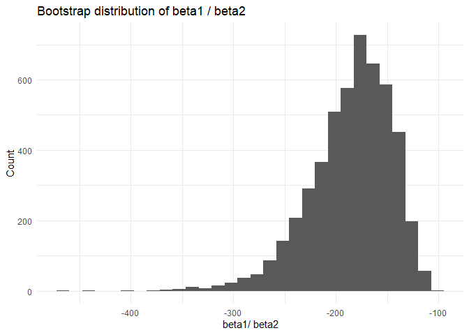
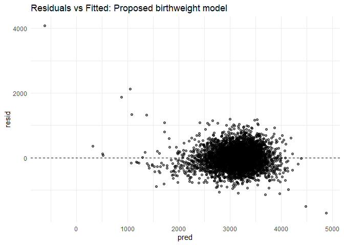

p8105_hw6_yd2865
================
Yan Duan
2025-11-29

I’m an R Markdown document!

## Problem 1

``` r
homicide_data = read_csv("./homicide-data.csv")
```

    ## Rows: 52179 Columns: 12
    ## ── Column specification ────────────────────────────────────────────────────────
    ## Delimiter: ","
    ## chr (9): uid, victim_last, victim_first, victim_race, victim_age, victim_sex...
    ## dbl (3): reported_date, lat, lon
    ## 
    ## ℹ Use `spec()` to retrieve the full column specification for this data.
    ## ℹ Specify the column types or set `show_col_types = FALSE` to quiet this message.

#### (1)

``` r
# tidy the dataset
homicides_clean =
  homicide_data |>
  mutate(
    city_state = str_c(city, state, sep = ", "),
    solved = if_else(disposition == "Closed by arrest", 1L, 0L),
    victim_age = na_if(victim_age, "Unknown"),
    victim_age = as.numeric(victim_age)) |>
  filter(!city_state %in% c(
      "Dallas, TX",
      "Phoenix, AZ",
      "Kansas City, MO",
      "Tulsa, AL"
    )
  ) |>
  filter(victim_race %in% c("White", "Black")) |>
  drop_na(solved, victim_age, victim_sex, victim_race)
```

#### (2)

``` r
# Baltimore data only
baltimore_df =
  homicides_clean |>
  filter(city_state == "Baltimore, MD")

# use the glm function
baltimore_glm =
  glm(
    solved ~ victim_age + victim_sex + victim_race,
    data  = baltimore_df,
    family = binomial)

# OR + CI for male vs. female
baltimore_or =
  broom::tidy(
    baltimore_glm,
    conf.int  = TRUE,
    exponentiate = TRUE) |>
  filter(term == "victim_sexMale") |>
  select(estimate, conf.low, conf.high, p.value)

baltimore_or
```

    ## # A tibble: 1 × 4
    ##   estimate conf.low conf.high  p.value
    ##      <dbl>    <dbl>     <dbl>    <dbl>
    ## 1    0.426    0.324     0.558 6.26e-10

The estimate of the adjusted OR is **0.426** and the confidence interval
is (**0.324**, **0.558**)

#### (3)

``` r
# run glm for each of the cities 
city_or =
  homicides_clean |>
  group_by(city_state) |>
  nest() |>
  mutate(
    model = purrr::map(
      data,
      ~ suppressWarnings(
          glm(
            solved ~ victim_age + victim_sex + victim_race,
            data  = .x,
            family = binomial
          )
      )
    ),
    tidy = purrr::map(     # OR + CI
      model,
      ~ suppressWarnings(
          broom::tidy(
            .x,
            conf.int = TRUE,
            exponentiate = TRUE)
      )
    )
  ) |>
  select(city_state, tidy) |>
  filter(!map_lgl(tidy, is.null)) |> 
  unnest(tidy) |>
  filter(term == "victim_sexMale") |>
  mutate(
    city_state = fct_inorder(city_state)
  ) |> 
  select(city_state, estimate, p.value, conf.low, conf.high)

city_or
```

    ## # A tibble: 47 × 5
    ## # Groups:   city_state [47]
    ##    city_state      estimate   p.value conf.low conf.high
    ##    <fct>              <dbl>     <dbl>    <dbl>     <dbl>
    ##  1 Albuquerque, NM    1.77  1.39 e- 1    0.825     3.76 
    ##  2 Atlanta, GA        1.00  1.000e+ 0    0.680     1.46 
    ##  3 Baltimore, MD      0.426 6.26 e-10    0.324     0.558
    ##  4 Baton Rouge, LA    0.381 1.65 e- 3    0.204     0.684
    ##  5 Birmingham, AL     0.870 5.11 e- 1    0.571     1.31 
    ##  6 Boston, MA         0.674 2.26 e- 1    0.353     1.28 
    ##  7 Buffalo, NY        0.521 2.90 e- 2    0.288     0.936
    ##  8 Charlotte, NC      0.884 6.00 e- 1    0.551     1.39 
    ##  9 Chicago, IL        0.410 1.86 e-18    0.336     0.501
    ## 10 Cincinnati, OH     0.400 6.49 e- 4    0.231     0.667
    ## # ℹ 37 more rows

#### (4)

``` r
# Create a plot shows the estimated ORs and CIs for each city
ggplot(city_or,
       aes(x = city_state, y = estimate)) +
  geom_hline(yintercept = 1, linetype = "dashed") +
  geom_point() +
  geom_errorbar(
    aes(ymin = conf.low, ymax = conf.high), width = 0
  ) +
  coord_flip() +
  labs(
    x = "City",
    y = "Adjusted odds ratio (Male vs Female)",
    title = "Adjusted ORs for solving homicides: male vs female victims"
  )
```

<!-- -->

The plot shows adjusted odds ratios for solving homicides (male vs
female victims) by city, ordered from lowest to highest OR. In most
cities the OR is below 1, meaning that, after adjusting for age and
race, cases with male victims are less likely to be solved than cases
with female victims. In several cities (for example Baltimore, Baton
Rouge, Birmingham and a few others near the bottom of the plot), the
entire 95% confidence interval falls below 1. Only a few cities have ORs
near or above 1, and those estimates tend to have wide confidence
intervals, so evidence of any advantage for male victims is weak.

## Problem 2

``` r
library(p8105.datasets)
data("weather_df")
set.seed(123) 
```

``` r
# the function of bootstrap
boostrap = function(df) {
  
  mod = lm(tmax ~ tmin + prcp, data = df)
  r_sq = broom::glance(mod) |>
    pull(r.squared)
  
  coef = broom::tidy(mod) |>
    select(term, estimate)
  
  beta_1 = coef |> filter(term == "tmin") |> pull(estimate)
  beta_2 = coef |> filter(term == "prcp") |> pull(estimate)
  beta_ratio = beta_1 / beta_2
  
  tibble(
    r_sq = r_sq,
    beta_ratio = beta_ratio
  )
}
```

``` r
# Use 5000 bootstrap samples
boot_results =
  weather_df |>
  modelr::bootstrap(n = 5000, id = "strap_id") |>
  mutate(
    estimates = map(strap, boostrap)
  ) |>
  unnest(estimates)
```

``` r
# Plot the distribution of r^2
ggplot(boot_results, aes(x = r_sq)) +
  geom_histogram(bins = 30) +
  labs(
    x = "R-squared",
    y = "Count",
    title = "Bootstrap distribution of R-squared"
  )
```

<!-- -->

The histogram is unimodal and roughly symmetric, centered around 0.94,
with most values lying between about 0.93 and 0.95. This indicates that
the goodness of fit of the linear model is very stable across bootstrap
samples, with only small variability in R-squared. In other words, tmin
and prcp together explain a very large proportion of the variability in
tmax.

``` r
# Plot the distribution of beta1 / beta2
ggplot(boot_results, aes(x = beta_ratio)) +
  geom_histogram(bins = 30) +
  labs(
    x = "beta1/ beta2",
    y = "Count",
    title = "Bootstrap distribution of beta1 / beta2"
  )
```

<!-- -->

The bootstrap distribution of b1/b2 is unimodal, much wider and clearly
left-skewed. All values of the ratio are negative, with the bulk of the
distribution concentrated around roughly −200, and a noticeable left
tail extending toward more negative values. The fact that the ratio is
consistently negative implies that tmin and prcp have effects on tmax in
opposite directions: one coefficient is positive while the other is
negative.

``` r
# identify the 2.5% and 97.5% quantiles to provide a 95% confidence interval
ci_boot =
  boot_results |>
  summarise(
    r_sq_lower = quantile(r_sq, 0.025),
    r_sq_upper = quantile(r_sq, 0.975),
    ratio_lower = quantile(beta_ratio, 0.025),
    ratio_upper = quantile(beta_ratio, 0.975))

ci_boot
```

    ## # A tibble: 1 × 4
    ##   r_sq_lower r_sq_upper ratio_lower ratio_upper
    ##        <dbl>      <dbl>       <dbl>       <dbl>
    ## 1      0.934      0.947       -279.       -125.

For R_squared, the confidence interval is (**0.934**, **0.947**).

For beta1/ beta2, the confidence interval is (**-279.253**,
**-125.279**).

## Problem 3

``` r
# read data
birthweight = read_csv("./birthweight.csv")
```

    ## Rows: 4342 Columns: 20
    ## ── Column specification ────────────────────────────────────────────────────────
    ## Delimiter: ","
    ## dbl (20): babysex, bhead, blength, bwt, delwt, fincome, frace, gaweeks, malf...
    ## 
    ## ℹ Use `spec()` to retrieve the full column specification for this data.
    ## ℹ Specify the column types or set `show_col_types = FALSE` to quiet this message.

``` r
# tidy data
birthweight =
  birthweight |> 
  janitor::clean_names() |> 
  mutate(
    babysex = factor(babysex, 
                     levels = c(1, 2), labels = c("Male", "Female")),
    frace = factor(frace, 
                   levels = c(1, 2, 3, 4, 8, 9), labels = c("White", "Black", "Asian", "Puerto Rican", "Other", "Unknown")),
    mrace = factor(mrace, 
                   levels = c(1, 2, 3, 4, 8), labels = c("White", "Black", "Asian", "Puerto Rican", "Other")),
    malform = factor(malform, 
                     levels = c(0, 1), labels = c("absent", "present"))
  ) |> 
   drop_na()

summary(birthweight)
```

    ##    babysex         bhead          blength           bwt           delwt      
    ##  Male  :2230   Min.   :21.00   Min.   :20.00   Min.   : 595   Min.   : 86.0  
    ##  Female:2112   1st Qu.:33.00   1st Qu.:48.00   1st Qu.:2807   1st Qu.:131.0  
    ##                Median :34.00   Median :50.00   Median :3132   Median :143.0  
    ##                Mean   :33.65   Mean   :49.75   Mean   :3114   Mean   :145.6  
    ##                3rd Qu.:35.00   3rd Qu.:51.00   3rd Qu.:3459   3rd Qu.:157.0  
    ##                Max.   :41.00   Max.   :63.00   Max.   :4791   Max.   :334.0  
    ##     fincome               frace         gaweeks         malform    
    ##  Min.   : 0.00   White       :2123   Min.   :17.70   absent :4327  
    ##  1st Qu.:25.00   Black       :1911   1st Qu.:38.30   present:  15  
    ##  Median :35.00   Asian       :  46   Median :39.90                 
    ##  Mean   :44.11   Puerto Rican: 248   Mean   :39.43                 
    ##  3rd Qu.:65.00   Other       :  14   3rd Qu.:41.10                 
    ##  Max.   :96.00   Unknown     :   0   Max.   :51.30                 
    ##     menarche        mheight          momage              mrace     
    ##  Min.   : 0.00   Min.   :48.00   Min.   :12.0   White       :2147  
    ##  1st Qu.:12.00   1st Qu.:62.00   1st Qu.:18.0   Black       :1909  
    ##  Median :12.00   Median :63.00   Median :20.0   Asian       :  43  
    ##  Mean   :12.51   Mean   :63.49   Mean   :20.3   Puerto Rican: 243  
    ##  3rd Qu.:13.00   3rd Qu.:65.00   3rd Qu.:22.0   Other       :   0  
    ##  Max.   :19.00   Max.   :77.00   Max.   :44.0                      
    ##      parity            pnumlbw     pnumsga      ppbmi            ppwt      
    ##  Min.   :0.000000   Min.   :0   Min.   :0   Min.   :13.07   Min.   : 70.0  
    ##  1st Qu.:0.000000   1st Qu.:0   1st Qu.:0   1st Qu.:19.53   1st Qu.:110.0  
    ##  Median :0.000000   Median :0   Median :0   Median :21.03   Median :120.0  
    ##  Mean   :0.002303   Mean   :0   Mean   :0   Mean   :21.57   Mean   :123.5  
    ##  3rd Qu.:0.000000   3rd Qu.:0   3rd Qu.:0   3rd Qu.:22.91   3rd Qu.:134.0  
    ##  Max.   :6.000000   Max.   :0   Max.   :0   Max.   :46.10   Max.   :287.0  
    ##      smoken           wtgain      
    ##  Min.   : 0.000   Min.   :-46.00  
    ##  1st Qu.: 0.000   1st Qu.: 15.00  
    ##  Median : 0.000   Median : 22.00  
    ##  Mean   : 4.145   Mean   : 22.08  
    ##  3rd Qu.: 5.000   3rd Qu.: 28.00  
    ##  Max.   :60.000   Max.   : 89.00

``` r
# Propose a regression model for birthweight
model1 = lm(bwt ~ blength + gaweeks + fincome +
              malform + momage + mheight + smoken, data = birthweight)
```

Description of modeling process: Based on the selected predictors, I
built a regression model to predict birthweight (`bwt`). I included
birth length (`blength`) and gestational age (`gaweeks`) because they
are strongly correlated with birthweight, as larger babies tend to have
greater length and longer gestational periods. Family income (`fincome`)
was included as it can influence maternal nutrition and access to
healthcare, which in turn affects fetal growth. I also considered the
presence of malformations (`malform`), as this could impact the
development and birthweight of the baby. Additionally, mother’s age
(`momage`) and mother’s height (`mheight`) were included, as they may
influence fetal development and birthweight. Finally, maternal smoking
(`smoken`) was included, as smoking during pregnancy is known to
negatively affect fetal growth and result in lower birthweight. After
fitting the model, I checked the residuals against the fitted values to
ensure no severe patterns were present and that the residuals were
roughly centered around zero.

``` r
birthweight = birthweight |> 
  modelr::add_predictions(model1) |> 
  modelr::add_residuals(model1)

# Make a plot of model residuals against fitted values
ggplot(birthweight, aes(x = pred, y = resid)) +
  geom_point(alpha = 0.5) +
  geom_hline(yintercept = 0, 
             linetype = "dashed") +
  geom_smooth(se = FALSE) +
  labs(title = "Residuals vs Fitted: Proposed birthweight model")
```

    ## `geom_smooth()` using method = 'gam' and formula = 'y ~ s(x, bs = "cs")'

<!-- -->

The scatter plot shows the relationship between residuals and fitted
values. Ideally, residuals should be randomly scattered with no visible
pattern. This plot shows that residuals are concentrated around 0 when
the fitted values are small, but they gradually increase in magnitude as
the fitted values get larger, forming a funnel shape (indicating
heteroscedasticity).

From the plot, we can see that as the fitted values increase, the spread
of the residuals also increases. This suggests that the model might
suffer from heteroscedasticity. The smooth curve stays close to zero in
the middle but bends downward at the very low and very high fitted
values.

``` r
# model 2: Only blength and gaweeks are used to predict birth weight
model2 = lm(bwt ~ blength + gaweeks, data = birthweight)

# model 3: Build a regression model that includes interaction terms
model3 = lm(bwt ~ bhead * blength * babysex, data = birthweight)
```

``` r
# comparison
cv_results = modelr::crossv_mc(birthweight, 100) |> 
  mutate(
    train = purrr::map(train, as_tibble),
    test  = purrr::map(test,  as_tibble)
  )
```

``` r
cv_model1 = cv_results |>
  mutate(
    pred = map2(train, test, ~predict(lm(bwt ~ blength + gaweeks + fincome + malform + momage + mheight + smoken, data = .x), newdata = .y)),
    error = map2_dbl(pred, test, ~sqrt(mean((.x - .y$bwt)^2))) 
  )

cv_model2 = cv_results |>
  mutate(
    pred2 = map2(train, test, ~predict(lm(bwt ~ blength + gaweeks, data = .x), newdata = .y)),
    error2 = map2_dbl(pred2, test, ~sqrt(mean((.x - .y$bwt)^2)))
  )

cv_model3 = cv_results |>
  mutate(
    pred3 = map2(train, test, ~predict(lm(bwt ~ bhead * blength * babysex, data = .x), newdata = .y)),
    error3 = map2_dbl(pred3, test, ~sqrt(mean((.x - .y$bwt)^2)))
  )

cv_model1$error |> mean()
```

    ## [1] 328.4786

``` r
cv_model2$error2 |> mean()
```

    ## [1] 333.7252

``` r
cv_model3$error3 |> mean()
```

    ## [1] 289.4728

Model 1 uses the following predictors: blength, gaweeks, fincome,
malform, momage, mheight, and smoken to predict the bwt. The RMSE of the
model is 326.1422, which is a moderate error.

Model 2 is simpler than Model 1 and uses only blength and gaweeks to
predict bwt. The error term for this model is higher than Model 1, with
an RMSE of 331.5341. This suggests that while the model is simpler, it
might not capture as much variability in birth weight compared to the
more complex model.

Model 3 use interaction terms between bhead, blength, and babysex to
predict bwt. The RMSE for Model 3 is the lowest at 288.3261, indicating
that it provides the best fit among the three models.
